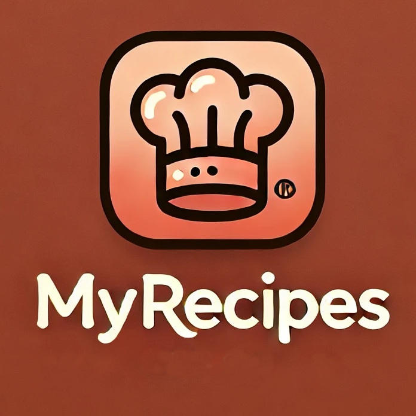

# MyRecipes

<p align="center">
  
</p>

Application Android native **MyRecipes** : consultation de recettes via l’API [TheMealDB](https://www.themealdb.com/api.php) (catégories, détail, recherche, favoris locaux, nutri-score custom).

Objectif : livrable de qualité **Play Store** (Kotlin, `minSdk 26`, layouts XML).

## Documentation

| Document | Contenu |
|----------|---------|
| [docs/CAHIER_DES_CHARGES.md](docs/CAHIER_DES_CHARGES.md) | Besoins B1–B12 et BN1–BN4 |
| [docs/API.md](docs/API.md) | Endpoints TheMealDB utilisés |
| [docs/maquette/index.html](docs/maquette/index.html) | Maquette visuelle interactive des écrans |
| [docs/maquette.md](docs/maquette.md) | Identité visuelle + lien vers la maquette |

## Stack

| Couche | Technologie |
|--------|-------------|
| Langage | Kotlin |
| UI | Android Views (XML) |
| Navigation | Drawer (Categories / Search / Favorites) |
| Réseau | Retrofit / OkHttp *(à venir)* |
| Images | Glide ou Coil *(à venir)* |
| Persistance | Jetpack Room *(favoris)* |
| API | TheMealDB V1 (clé de test `1`) |

## Prérequis

- Android Studio (version récente)
- JDK 11+
- Émulateur ou appareil `minSdk 26`

## Lancer le projet

1. Ouvrir le dossier du repo dans Android Studio.
2. Laisser Gradle synchroniser.
3. Lancer la configuration `app` sur un émulateur / appareil.

```text
./gradlew :app:assembleDebug
```

## Structure du dépôt

```text
MyRecipes_Luque/
├── app/                 # Module Android
├── docs/
│   ├── API.md
│   ├── CAHIER_DES_CHARGES.md
│   ├── maquette.md
│   ├── maquette/
│   │   └── index.html   # maquette visuelle
│   └── assets/
│       └── my_recipes_icon.jpg
└── README.md
```

## Feuille de route (features)

1. Documentation API + maquette *(fait)*
2. Navigation drawer + squelette des écrans *(fait)*
3. Icône launcher + palette *(fait)*
4. Liste des catégories
5. Liste des recettes par catégorie
6. Écran détail recette
7. Custom View nutri-score
8. Recherche
9. Favoris Room
10. Polish release Play Store

## Licence / attribution

Données recettes : [TheMealDB](https://www.themealdb.com/).  
Projet pédagogique Ynov — Android Natif.
