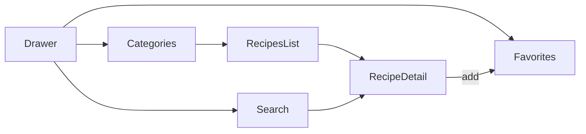

# Maquette — MyRecipes

## Voir les maquettes

Ouvre la maquette visuelle interactive dans un navigateur :

**[docs/maquette/index.html](maquette/index.html)**

Elle présente, sous forme de téléphones réalistes :

- Menu hamburger (drawer)
- Categories
- `{Category} Recipes`
- Détail recette (photo, chips, nutri-score, ingrédients, favoris)
- Search
- Favorites

Palette et photos d’exemple TheMealDB pour se projeter dans l’UI XML finale.

## Identité visuelle

| Rôle | Couleur | Hex indicatif |
|------|---------|---------------|
| Fond / marque | Terracotta | `#8B4A3B` |
| Contours / texte fort | Brun chocolat | `#3D2314` |
| Accent dégradé haut | Pêche | `#F5C9B0` |
| Accent dégradé bas | Corail | `#E8917A` |
| Texte sur fond sombre | Crème | `#F5EDE6` |
| Surface écrans | Clair | `#FFF8F5` |

Ces valeurs serviront de base pour `res/values/colors.xml` (feature launcher / palette).

## Navigation

